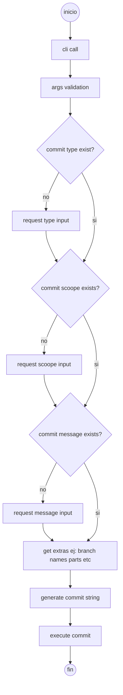

# ccommit

ccommit is a CLI to create quickly git commits using the conventional commit specification.

## versions

### V1 (current)

Simple 0 dependency script to quickly commit in the terminal with basic validations.

### V2 (incoming WIP)

New version including the same features on V1 but using fancy libraries, new features and better UX.

## how this works?

